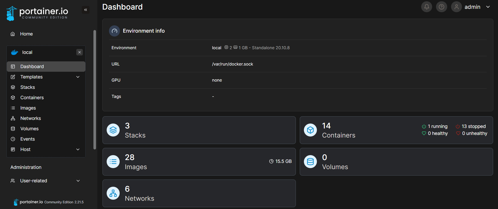
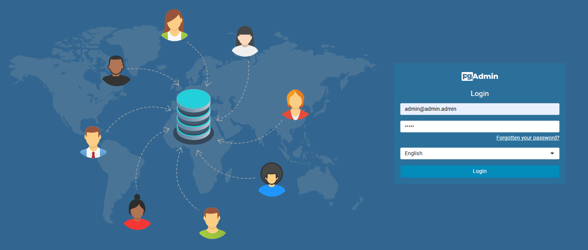

<h1 id="top" align="center">Core <br/> Docker Config</h1> 

<br>

<div align="center">
    
</div>

## 🔍 Table of Contents

- [About Project](#intro)
- [Technologies](#technologies)
- [Releases](#releases)
- [Features](#features)
- [Dashboards](#dashboards)
- [System Links](#system-links)
- [System Preperation](#system-preperation)
- [System Startup](#system-startup)
- [Contributors](#contributors)
 
<br/>

<h2 id="intro">📌 About Project</h2> 

This project is designed to integrate various microservice technologies, providing a ready-to-use, convenient solution for deployment and management.

<br/>

<h2 id="technologies">☄️ Technologies</h2>

### DevOps

&nbsp; [](https://www.docker.com/)

&nbsp; [](https://www.portainer.io/)

### Distribution

&nbsp; [](https://alpinelinux.org/)

### Build Tools

&nbsp; [](https://maven.apache.org/)

### ORM

&nbsp; [](https://hibernate.org/)

### Database

&nbsp; [](https://www.mysql.com/)

&nbsp; [](https://www.postgresql.org/)

&nbsp; [](https://www.phpmyadmin.net/)

&nbsp; [](https://www.pgadmin.org/)

### Security

&nbsp; [](https://jwt.io/)

### Web

&nbsp; [](https://www.java.com/)

&nbsp; [](https://spring.io/)

&nbsp; [](https://spring.io/projects/spring-boot)

&nbsp; [](https://tomcat.apache.org/)

&nbsp; [](https://swagger.io/)

&nbsp; [](https://www.ibm.com/docs/bg/aix/7.2?topic=files-env-file)

### Test

&nbsp; [](https://mochajs.org/)

&nbsp; [](https://www.postman.com/)

### Report

&nbsp; [](https://mochajs.org/)

<br/>

<h2 id="releases">🚢 Releases</h2> 

&nbsp; [](https://github.com/ahmettoguz/core-docker-config/tree/v1.0.0)

<br/>

<h2 id="service-versions">🧩 Service Versions</h2> 

| Service                                            | Version                                                                                                                                                                                                 |
|----------------------------------------------------|---------------------------------------------------------------------------------------------------------------------------------------------------------------------------------------------------------|
| core-docker-config                                 | [](https://github.com/ahmettoguz/core-docker-config/tree/v1.0.0)                                 |
| core-java-spring-boot-rest-api                     | [](https://github.com/ahmettoguz/core-java-spring-boot-rest-api/tree/v1.0.0)                     |
| core-mocha-api-automation-test                     | [](https://github.com/ahmettoguz/core-mocha-api-automation-test/tree/v1.0.0)                     |
| core-database-initializer-alpine-mysql-client      | [](https://github.com/ahmettoguz/core-database-initializer-alpine-mysql-client/tree/v1.0.0)      |
| core-database-initializer-alpine-postgresql-client | [](https://github.com/ahmettoguz/core-database-initializer-alpine-postgresql-client/tree/v1.1.2) |
| core-pgadmin                                       | [](https://github.com/ahmettoguz/core-pgadmin/tree/v1.0.0)                                       |
| core-postgresql                                    | [](https://github.com/ahmettoguz/core-postgresql/tree/v1.3.0)                                    |
| core-mysql                                         | [](https://github.com/ahmettoguz/core-mysql/tree/v1.0.0)                                         |
| core-phpmyadmin                                    | [](https://github.com/ahmettoguz/core-phpmyadmin/tree/v1.0.0)                                    |
| core-portainer                                     | [](https://github.com/ahmettoguz/core-portainer/tree/v1.0.0)                                     |

<br/>

<h2 id="features">🔥 Features</h2>

### Core Docker Config

+ **Docker-Compose Configuration:** Comprehensive Docker-Compose configuration for managing service orchestration.

### Core Portainer

+ **Container Management:** Easily manage Docker containers, images, networks, and volumes through a user-friendly web interface.
+ **Multi-Environment Support:** Support to different Docker environments for efficient management.
+ **Stack Deployment:** Deploy and manage Docker stacks using Docker-Compose files directly from the Portainer interface.
+ **Bind Mount:** Leverages Docker bind-mounts to store data on the host machine, ensuring data persistence, reliability, and consistency across container restarts or updates.
+ **Docker Containerization:** The application is containerized using Docker to ensure consistent deployment, scalability, and isolation across different environments.

### Core Java Spring Boot Rest Api

+ **Relational Database Management:** Efficient handling of relational data with ORM, supporting one-to-one, one-to-many, and many-to-many relationships.
+ **Hot Reload:** Changes in the codebase can be instantly reflected without needing to restart the application.
+ **Environment Configuration:** Configurations have been adjusted for enhanced flexibility.
+ **AOP:** Aspect-Oriented Programming handles authentication and authorization separately from business logic, ensuring security across the application.
+ **Lombok:** Lombok is used to eliminate boilerplate code for better readability and maintainability.
+ **JWT Authentication:** User authentication and authorization are managed with JSON Web Tokens for secure, stateless sessions.
+ **Exceptions:** The application manages both custom and global exceptions for error handling.
+ **Swagger Documentation:** Comprehensive API documentation integrated for documentation and testing purposes.
+ **Automated & Manual Testing:** Both automated and manual tests implemented for quality assurance.
+ **Docker Containerization:** The application is containerized using Docker to ensure consistent deployment, scalability, and isolation across different environments.

### Core Mocha Api Automation Test

- **Parallel and Standard Modes:** Run tests in parallel for faster execution or in standard mode.
- **Auto-generated Reports:** Automatically generates detailed reports summarizing test results and highlighting any issues.
- **Postman Scripts:** Includes Postman scripts for testing all API endpoints, enabling manual testing and validation of functionality.
- **Database Cleanup:** Ability to clean database data, ensuring the environment is reset and ready for the next test run.
- **Comprehensive API Testing:** Tests all API endpoints for correctness.
- **Environment Variables**: Support for environment variables to manage configurations.
+ **Docker Containerization:** The application is containerized using Docker to ensure consistent deployment, scalability, and isolation across different environments.

### Core Database Initializer Alpine MySQL Client

+ **Database Initialization:** Automatically sets up the MySQL database schema and loads seed data during container startup.
+ **Lightweight Alpine Base:** Built using an Alpine Linux base for minimal image size and faster startup.
+ **Felxibility:** Easily modify the default schema and data by updating SQL scripts in the project.
+ **Docker Containerization:** The application is containerized using Docker to ensure consistent deployment, scalability, and isolation across different environments.

### Core Database Initializer Alpine PostgreSQL Client

+ **Database Initialization:** Automatically sets up the PostgreSQL database schema and loads seed data during container startup.
+ **pgAdmin Backup:** Exports from pgAdmin are stored in the bind mount directory `/backup` for easy access and management.
+ **Lightweight Alpine Base:** Built using an Alpine Linux base for minimal image size and faster startup.
+ **Felxibility:** Easily modify the default schema and data by updating SQL scripts in the project.
+ **Docker Containerization:** The application is containerized for consistent deployment and scaling.

### Core PostgreSQL

+ **Bind Mount:** Leverages Docker bind-mounts to store data on the host machine, ensuring data persistence, reliability, and consistency across container restarts or updates.
+ **Docker Containerization:** The application is containerized using Docker to ensure consistent deployment, scalability, and isolation across different environments.

### Core MySQL

+ **Bind Mount:** Leverages Docker bind-mounts to store data on the host machine, ensuring data persistence, reliability, and consistency across container restarts or updates.
+ **Docker Containerization:** The application is containerized using Docker to ensure consistent deployment, scalability, and isolation across different environments.

### Core PhpMyAdmin

+ **Dark Theme Interface:** A phpMyAdmin dashboard for managing MySQL databases with a dark theme.
+ **Docker Containerization:** The application is containerized using Docker to ensure consistent deployment, scalability, and isolation across different environments.

### Core pgAdmin

+ **Bind Mount for Persistent Data:** Leverages Docker bind-mounts to store data on the host machine, ensuring data persistence, reliability, and consistency across container restarts or updates.
+ **Bind Mount for Backup Directory:** Utilizes a bind mount for backup storage.
+ **Docker Containerization:** The application is containerized using Docker to ensure consistent deployment, scalability, and isolation across different environments.

<br/>

<h2 id="dashboards">🐳 Portainer Dashboard</h2>

Portainer provides an intuitive web-based UI to manage Docker environments, simplifying container orchestration, monitoring, and deployment. It allows users to visualize stacks, containers, networks, volumes, and services.

<div align="center">
    
</div>

<br/>

<h2>🐘 pgAdmin Dashboard</h2>

pgAdmin provides an intuitive web-based UI for managing PostgreSQL databases, simplifying tasks such as database administration, monitoring, and query execution. It allows users to visualize and manage databases, schemas, tables, and other database objects efficiently.

<div align="center">
    
</div>

<br/>

<h2 id="system-links">🔗 System Links</h2> 

| Service            | URL                                                        |
|--------------------|------------------------------------------------------------|
| Backend Swagger UI | https://coreapp.com.tr/backend/sw/swagger-ui/index.html    |

<br/>

<h2 id="system-preperation">🔧 System Preperation</h2>

* Create a new directory named `core`.
* Clone repositories.

```
git clone https://github.com/ahmettoguz/core-docker-config
git clone https://github.com/ahmettoguz/core-java-spring-boot-rest-api
git clone https://github.com/ahmettoguz/core-mocha-api-automation-test
git clone https://github.com/ahmettoguz/core-database-initializer-alpine-mysql-client
git clone https://github.com/ahmettoguz/core-database-initializer-alpine-postgresql-client
git clone https://github.com/ahmettoguz/core-postgresql
git clone https://github.com/ahmettoguz/core-pgadmin
git clone https://github.com/ahmettoguz/core-mysql
git clone https://github.com/ahmettoguz/core-phpmyadmin
git clone https://github.com/ahmettoguz/core-portainer
```

<br/>

### Core Mocha Api Automation Test

* Start the database.
* Initialize the database.
* Launch the backend server.
* Modify `.env` file for further configurations.
* Install dependencies

```
npm i
```

### Core PostgreSQL

* Modify the `.env` file using `.env.example` as a reference.

### Core pgAdmin

* Modify the `.env` file using `.env.example` as a reference.

### Core MySQL

* Modify `.env` file for further configurations.

### Core PhpMyAdmin

* Modify `.env` file for further configurations.

### Core Database Initializer Alpine MySQL Client

* Start the database.
* Modify the `.env` file to configure database credentials, host and database name.
* Replace the `init.sql` file with your custom SQL script to initialize the database schema and seed data.

### Core Database Initializer Alpine PostgreSQL Client

* Start the database.
* Modify the `.env` file using `.env.example` as a reference.
* Replace the `init.sql` file with your custom SQL script to initialize the database schema and seed data.

<br/>

<h3 id="developer-mode">🧪 Developer Mode</h3>

### Core Java Spring Boot Rest Api

* Modify `application-dev.properties` file for further configurations.

<br/>

<h3 id="production-mode">⚡Production Mode</h3> 

### Core Java Spring Boot Rest Api

* Copy `application-dev.properties` to create `application-prod.properties`. Refer to `production-example.txt` for guidance.

<br/>
  
<h2 id="system-startup">🚀 System Startup</h2>

### Stack
```
docker compose -p core build
docker compose -p core up -d
docker compose -p core up -d --build
docker compose -p core down
```

### PostgreSQL
```
docker compose -p core build         postgresql
docker compose -p core up -d         postgresql
docker compose -p core up --build -d postgresql
docker stop                          cs-postgresql-c
docker rm                            cs-postgresql-c
docker logs -f                       cs-postgresql-c
```

### pgAdmin
```
docker compose -p core build         pgadmin
docker compose -p core up -d         pgadmin
docker compose -p core up --build -d pgadmin
docker stop                          core-pgadmin-c
docker rm                            core-pgadmin-c
docker logs -f                       core-pgadmin-c
```

### PostgreSQL DB Initializer
```
docker compose -p core build         database-initializer-postgresql
docker compose -p core up -d         database-initializer-postgresql
docker compose -p core up --build -d database-initializer-postgresql
docker stop                          core-database-initializer-postgresql-c
docker rm                            core-database-initializer-postgresql-c
docker logs -f                       core-database-initializer-postgresql-c
```

### MySQL
```
docker compose -p core build         my-sql
docker compose -p core up -d         my-sql
docker compose -p core up --build -d my-sql
docker stop                          core-my-sql-c
docker rm                            core-my-sql-c
docker logs -f                       core-my-sql-c
```

### PhpMyadmin 
```
docker compose -p core build         core-php-myadmin
docker compose -p core up -d         core-php-myadmin
docker compose -p core up --build -d core-php-myadmin
docker stop                          core-php-myadmin-c
docker rm                            core-php-myadmin-c
docker logs -f                       core-php-myadmin-c
```

### MySQL DB Initializer
```
docker compose -p core build         database-initializer-mysql
docker compose -p core up -d         database-initializer-mysql
docker compose -p core up --build -d database-initializer-mysql
docker stop                          core-database-initializer-mysql-c
docker rm                            core-database-initializer-mysql-c
docker logs -f                       core-database-initializer-mysql-c
```

### Backend
```
docker compose -p core build         backend
docker compose -p core up -d         backend
docker compose -p core up --build -d backend
docker stop                          core-backend-c
docker rm                            core-backend-c
docker logs -f                       core-backend-c
```


### Portainer 
```
docker compose -p core build         portainer
docker compose -p core up -d         portainer
docker compose -p core up --build -d portainer
docker stop                          core-portainer-c
docker rm                            core-portainer-c
docker logs -f                       core-portainer-c
```

### Monitor & Inspect
```
docker exec -it core-backend-c /bin/sh
docker inspect core-backend-c
```

<br/>

<h2 id="contributors">👥 Contributors</h2> 

<a href="https://github.com/ahmettoguz" target="_blank"></a> 

### [🔝](#top)